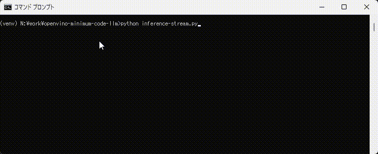

# Minimum code to run an LLM model from HuggingFace with OpenVINO

## Programs / Files
|#|file name|description|
|---|---|---|
|1|download_model.py|Download a LLM model, and convert it into OpenVINO IR model|
|2|inference.py|Run an LLM model with OpenVINO. One of the most simple LLM inferencing code with OpenVINO and the `optimum-intel` library.|
|3|inference-stream.py|Run an LLM model with OpenVINO and `optimum-intel`. Display the answer in streaming mode (word by word).|
|4|inference-stream-openvino-only.py|Run an LLM model with only OpenVINO (+HF tokenizer). This program doesn't require any DL frameworks such as TF or PyTorch. Also, this program even doesn't use '`optimum-intel`' library to run.| 
|5|inference-stream-openvino-only-no-kv-cache-slow-slow.py|Same as program #4 but doesn't use KV-cache. This program calculates KV values on every iteration and is very slow. You can compare the performance of #4 and #5 and understand how much KV-caching improves the LLM inference performance.|

## How to run

1. Preparation

Note: Converting LLM model requires a large amount of memory (>=32GB).
```sh
python -m venv venv
venv\Scripts\activate
python -m pip install -U pip
pip install -U setuptools wheel
pip install -r requirements.txt
```

2. Download an LLM model and generate OpenVINO IR models
```sh
python download_model.py
```
**Hint**: You can use `optimum-cli` tool to download the models from Huggingface hub, too. You need to install `optimum-intel` Python package to export the model for OpenVINO.  
```sh
optimum-cli export openvino -m intel/neural-chat-7b-v3 --weight-format int4_sym_g64 neural-chat-7b-v3/INT4
```

3. Run inference
```sh
python inference.py
# or
python inference-stream.py
```




## Official '`optimum-intel`' documents  
Following web sites are also infomative and helpful for `optimum-intel` users.  
- ['optimum-intel' GitGHub Repository](https://github.com/huggingface/optimum-intel)  
- [Detailed description of inference API](https://huggingface.co/docs/optimum/intel/inference)

## Test environment
- Windows 11
- OpenVINO 2023.3.0 LTS
